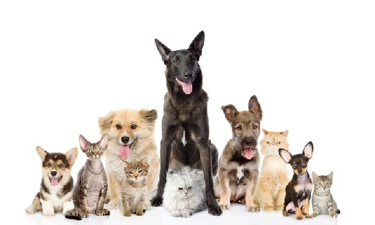
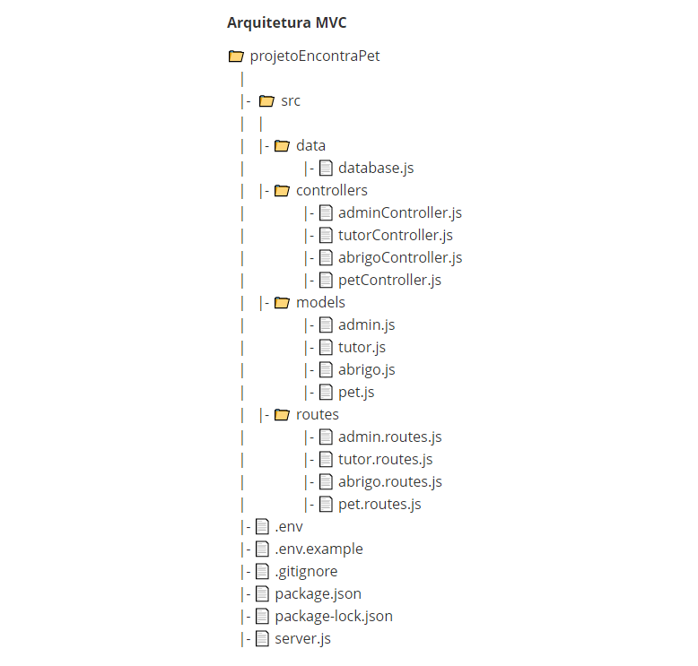

# Projeto Final - Encontra Pet 

Autora: Jezielle Cunha
---

### Sumário:

##### [Tema Proposto](#tema-proposto-1)

##### [Apresentação](#apresentação-1)

##### [Contextualização](#contextualização-1)

##### [Rotas/EndPoints](#rotasendpoints-1)

##### [Desenvolvimento](#desenvolvimento-1)

##### [Regras de Negócio](#regras-de-negócio-1)

##### [Tecnologias Utilizadas](#tecnologias-utilizadas-1)

##### [Implementações Futuras](#implementações-futuras-1)

##### [Referências](#referências-1)

### Tema Proposto

Facilitar o encontro de animais de estimação para adoção nas instituições que abrigam animais abandonados. A aplicação torna possível um pretendente a tutor procurar por um animalzinho sem sair de casa. Podendo realizar buscas filtrando por abrigo, espécie (se gato ou cachorro), sexo e se castrado ou não.  

### Apresentação 

O "Encontra Pet" é um projeto de conclusão de curso para o Bootcamp Back-end da {reprograma} constituído por uma API Rest que tem como objetivo reunir e disponibilizar informações sobre cães e gatos que precisam ser adotados para consulta de pretendentes a tutores. E com isso facilitar o proccesso de adoção responsável.

O intuíto é que a aplicação seja como uma ponte entre as pessoas que pretendem adotar e os animais disponíveis para adoção que estão em abrigos. Aqueles que têm o intuito de adotar, poderão buscar os pets por meio de alguns filtros e  encontrar um novo amiguinho segundo suas preferências e/ou necessidades. 

### Contextualização

A população de animais abandonados se multiplica nos espaços urbanos. Situação que se agravou com a chegada da pandemia de Convid-19, pois muitos tutores abandonaram seus animais domésticos por não conseguir mantê-los, dentre outros motivos. O resgate e a adoção são para muitos deles a única chance de sobrevivência, e para todos eles, a únida possibilidade de uma vida digna.
A solução viável para sanar esse problema ambiental e de saúde pública é a união de esforços em ações de resgate, acolhimento, tratamento, castração e encaminhamento para adoção responsável. Para esta última ação citada, a API Encontra Pet se dispõe a ajudar.
### Rotas/EndPoints

Esta API está sendo escutada localmente na ``porta 8080 `` e para que as rotas possam ser acessadas é necessário utilizar ``http://localhost:8080`` antes dos endpoints de requisição.

|VERBO | ROTA | DESCRIÇÃO|
|------|------|----------|
|GET | /pet | Retorna uma lista com todos os pets.|
|GET | /pet/:id | Retorna um pet pelo ID requerido.|
|GET | /pet/busca | Retorna uma lista com os pets filtrados por características.|
|GET | /pet/abrigo | Retorna uma lista com todos os pets de um abrigo requerido.
|GET | /abrigo | Retorna uma lista com todos os abrigos.|
|GET | /abrigo/:id | Retorna uma abrigo pelo ID requerido. |
|GET | /abrigo/busca | Retorna uma lista com abrigos pela busca de endereço. |
|GET | /admin | Retorna uma lista com todos os administradores.|
|GET | /admin/:id | Retorna um administrador pelo ID requerido. |
|GET | /tutor | Retorna uma lista com todos os tutors.|
|GET | /tutor/:id | Retorna um tutor pelo ID requerido. |
|POST | /pet | Cria um novo cadastro com base no petSchema.|
|POST | /abrigo | Cria um novo cadastro com base no abrigoSchema.|
|POST | /admin | Cria um novo cadastro com base no adminSchema.|
|POST | /tutor | Cria um novo cadastro com base no tutorSchema.|
|PATCH | /pet/:id | Edita um pet correspondente ao ID requerido.|
|PATCH | /abrigo/:id | Edita um abrigo correspondente ao ID requerido.|
|PATCH | /admin/:id | Edita um administrador correspondente ao ID requerido.|
|PATCH | /tutot/:id | Edita um tutot correspondente ao ID requerido.|
|DELETE | /pet/:id | Exclui o cadastro de um pet correspondente ao ID requerido.|
|DELETE | /abrigo/:id |Exclui o cadastro de um abrigo correspondente ao ID requerido.|
|DELETE | /admin/:id | Exclui o cadastro de um admin correspondente ao ID requerido.|
|DELETE | /tutor/:id | Exclui o cadastro de um tutor correspondente ao ID requerido.|

### Desenvolvimento

### Regras de Negócio ###
* Para criar um novo administrador ou novo pet, será necessário vincular a um abrigo já existente no sistema no momento da criação, utilizando o numero do id do abrigo correspondente no corpo da requisição.
* O usuário final (Tutor) poderá realizar as buscas de todos os abrigos, todos os pets, buscar os abrigos por endereço, buscar todos os pets de determinado abrigo e buscar o pet por qualquer característica.

### Tecnologias utilizadas

                                                                                         
|Ferramenta | Descrição |
|-----------|-----------|
|JavaScript | Linguagem de programação. |
Node JS | Ambiente de execução do JavaScript. |
|Express | Framework Node JS. |
|Mongoose | Dependência que interage com o MongoDB para a conexão da database, criação do model e das collections. |
|Nodemon | Dependência que observa as atualizações realizadas nos documentos para rodar o    servidor automaticamente. |
|Cors | Dependência que facilita a permissão de acesso à API. |
|Dotenv | Dependência que ajuda a proteger dados sensíveis.           
|npm |  Gerenciador de pacotes. |
|MongoDB |  Banco de dados não relacional orientado a documentos. |
|Robo 3T | Interface gráfica para verificar se os dados foram persistidos na database. |
|Postman | Interface gráfica para realizar os testes. |
|Git/GitHub | Versionamento de código. |
|Heroku | Plataforma em nuvem para deploy. |                        
                                                       

### Implementações futuras

* Validação/autenticação dos acessos;
* Refatorar o código para retirar repetições;Implementar front-end;
* Nova funcionalidade: Apadrinhamento;
* Nova funcionalidade: Campanha Educativa de Adoção Responsável;
* Nova funcionalidade: Campanha Divulgação de castração gratuita;
* Consumir outras API’s ex: Google Maps e Viacep;
* Incluir paginação na API.

### Referências

Adoção e abandono de animais domésticos aumentam durante a pandemia;<https://agenciabrasil.ebc.com.br/geral/noticia/2020-10/adocao-e-abandono-de-animais-domesticos-aumentam-durante-pandemia>

Adote um vira-lata;<https://www.ufpe.br/documents/1523864/1524082/Adote_Abandono_UFPE_folder_montado_E02+%281%29.pdf/83dea80f-e3df-45a7-9380-c52826edc7a1>

ONGs e poder público se unem contra do drama de abandono de animais;<https://www.folhape.com.br/noticias/ongs-e-poder-publico-se-unem-contra-o-drama-de-abandono-de-animais/116808/>

Projeto de Lei Alepe;<https://www.alepe.pe.gov.br/proposicao-texto-completo/?docid=6863&tipoprop=p>

Resgate de animais: o amor que salva vidas.<https://www.folhape.com.br/colunistas/folha-pet/resgate-animal-um-amor-que-salva-vidas/25601/>

[Heroku](https://encontrapet-projeto.herokuapp.com/)

